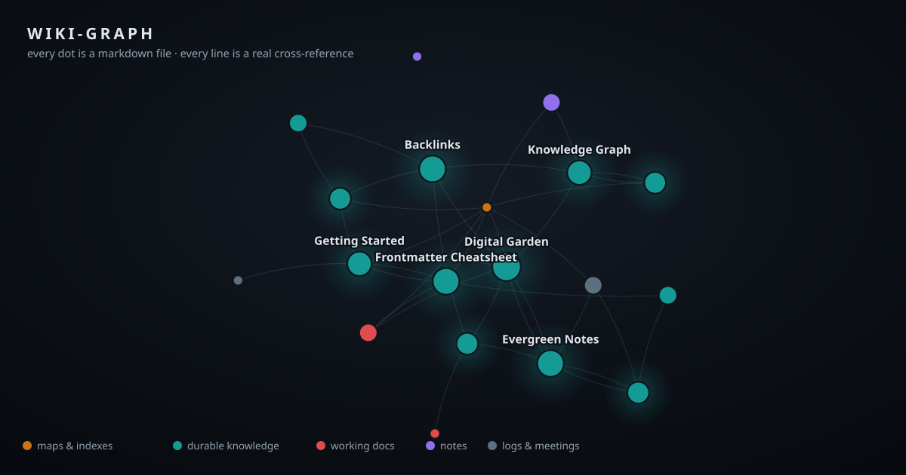

# wiki-graph

**See your markdown docs as a living knowledge graph.**

One command turns any folder of markdown — a wiki, a docs repo, an Obsidian
vault, a pile of notes — into an interactive, Obsidian-style force graph in a
single self-contained HTML file, plus a machine-readable `graph.json` that AI
agents can reason over. It can rebuild itself **live** as you (or your coding
agent) edit, or on a schedule.



[](https://github.com/galaxyuliana/wiki-graph/actions/workflows/ci.yml)
[](LICENSE)


- **Zero dependencies.** Python stdlib in, one HTML file out. No npm, no pip,
  no server, no telemetry — everything stays on your machine.
- **Any agent, or no agent.** Ships as a portable
  [Agent Skill](https://agentskills.io) (works in Claude Code, Codex CLI,
  Cursor, Gemini CLI, Copilot, and 30+ other tools), as a Claude Code plugin
  with automatic live updates, and as a plain CLI.
- **Every dot is a markdown file, every line is a real cross-reference** —
  both `[text](path.md)` links and Obsidian `[[wikilinks]]`.

## Features

- 🕸 **Force-directed graph** with glowing hubs, cluster labels, drag, pan,
  zoom, and a detail panel with backlinks
- 🔴 **Live mode** — the served page morphs in place as docs change; new
  notes flash into the web while your agent writes them
- ⏪ **Timeline replay** — watch your wiki grow commit by commit (from git
  history or frontmatter dates)
- 🎨 **Color by type, folder, or status** — legends adapt to *your* repo's
  actual values; repos with no frontmatter get folder colors automatically
- 🔍 **Search** titles, paths, and `#tags`; press `/` to jump to the box
- 🧭 **Orphan & hub analytics** — unlinked docs, inbound/outbound degrees
- 🩺 **Broken-link checker** — `--check` exits non-zero for CI
- 🌗 Dark/light theme, `prefers-reduced-motion` respected
- 🤖 **`graph.json`** — agents answer "what's an orphan?", "what's the hub?",
  "what links to X?" without parsing markdown

## Quick start

### Plain CLI (works everywhere)

```bash
git clone https://github.com/galaxyuliana/wiki-graph ~/tools/wiki-graph
python3 ~/tools/wiki-graph/build.py ~/my-wiki --open
```

Outputs land in `~/my-wiki/.wiki-graph/` (`wiki-graph.html` + `graph.json`).
The folder writes its own `.gitignore`, so it never dirties your repo —
`git add -f .wiki-graph` if you *want* to commit the graph.
Try it on the bundled demo first:

```bash
python3 ~/tools/wiki-graph/build.py ~/tools/wiki-graph/examples/demo-wiki --open
```

### Claude Code (plugin)

```
/plugin marketplace add galaxyuliana/wiki-graph
/plugin install wiki-graph@wiki-graph
```

Then in any repo: `/wiki-graph`. The first build also switches on live mode
for that repo (see below).

### Any other agent (Agent Skills standard)

Copy `skills/wiki-graph/` into wherever your tool discovers skills
(Codex CLI, Cursor, Gemini CLI, Copilot, Goose, … — see
[agentskills.io](https://agentskills.io)). The skill is fully self-contained.

## Keeping the graph fresh

| Mode | How | Works with |
|---|---|---|
| **Manual** | `/wiki-graph` or `python3 build.py` | everything |
| **Live** | Claude Code hook · `--serve` · AGENTS.md rule · git hook | see below |
| **Scheduled** | cron / CI / GitHub Pages workflow | everything |

### Live

- **Claude Code hook** (installed with the plugin): after any markdown edit,
  the graph rebuilds silently. It's opt-in per repo — the hook only acts
  where `.wiki-graph/graph.json` already exists, so build once to enable,
  delete the folder to disable. Costs zero in repos without a graph.
- **`--serve`** (any setup): `python3 build.py ~/my-wiki --serve` watches for
  changes, rebuilds, and serves at `http://127.0.0.1:7177/wiki-graph.html`.
  The open page polls and **morphs in place** — a `● live` badge pulses in
  the header. Pair it with the hook (or `--watch`) and leave it on a second
  monitor while your agent works.
- **Any agent via AGENTS.md**: paste the block from
  [`integrations/AGENTS.md-snippet.md`](integrations/AGENTS.md-snippet.md)
  into your repo's `AGENTS.md` — Codex, Cursor, Gemini CLI, Copilot, etc.
  will rebuild after editing docs.
- **Any editor via git**: [`integrations/post-commit`](integrations/post-commit)
  rebuilds after each commit that touches markdown.

### Scheduled

- **cron**: `0 7 * * * python3 ~/tools/wiki-graph/build.py ~/my-wiki --quiet`
- **Claude Code**: ask Claude to "rebuild my wiki graph every morning" — the
  skill knows how to schedule itself.
- **GitHub Pages**: copy
  [`integrations/github-pages.yml`](integrations/github-pages.yml) into your
  wiki repo's `.github/workflows/` and your graph gets a public URL that
  redeploys on every push (and daily, for the timeline).

## Frontmatter (all optional)

```yaml
---
title: Nice Display Name        # default: the filename
type: concept                   # drives color; see groups below
status: living                  # living | draft | frozen | archived
tags: [linking, style]          # searchable as #tag
date: 2026-05-04                # timeline fallback when there's no git history
---
```

Type groups: `index` → **maps & indexes** · `concept` `guide` `reference`
`runbook` `tutorial` `spec` `glossary` … → **durable knowledge** ·
`decision` `adr` `rfc` `plan` `analysis` … → **working docs** · `note`
`idea` `draft` → **notes** · `journal` `changelog` `meeting-note` `log` … →
**logs & meetings**. Anything else is "other", and untyped repos are colored
by folder instead — no frontmatter required.

## Per-repo config (optional)

`.wiki-graph.json` at the repo root:

```json
{ "title": "My Wiki", "roots": ["docs"], "ignore": ["vendor", "drafts"] }
```

## Vendoring (optional)

Teams that want a version-pinned copy that works with no plugin installed can
commit the builder into their repo:

```bash
cp -r ~/tools/wiki-graph/skills/wiki-graph/scripts my-wiki/tools/wiki-graph
```

The skill prefers `tools/wiki-graph/build.py` when a repo has one, so
everyone (and every agent) builds with the repo's own pinned version.

## For agents: graph.json

```jsonc
{
  "generated": "2026-07-10T09:30:00",
  "title": "demo-wiki",
  "nodes": [{ "path": "concepts/backlinks.md", "title": "Backlinks",
              "type": "concept", "status": "living", "tags": ["linking"],
              "area": "concepts", "in": 4, "out": 1, "born": "2026-03-16" }],
  "edges": [["index.md", "concepts/digital-garden.md"]],
  "broken": [["guides/old.md", "missing.md"]]
}
```

`in + out == 0` → orphan · high `in` → hub · `broken` → dangling links
(`--check` exits 1 when non-empty, for CI).

## Design principles

1. **Lightweight is a feature.** Stdlib-only builder, single-file output,
   no build step, no external requests. If a change needs a dependency,
   it's probably out of scope.
2. **Generic by default.** Nothing in the code knows about any particular
   wiki, company, or taxonomy. Repo-specific behavior belongs in
   `.wiki-graph.json`.
3. **Agent-native, not agent-locked.** Every feature must be usable from a
   plain terminal; agent integrations are thin adapters.

## Contributing

PRs welcome — see [CONTRIBUTING.md](CONTRIBUTING.md).
Run the tests with `python3 -m unittest discover tests`.

## License

[MIT](LICENSE)
